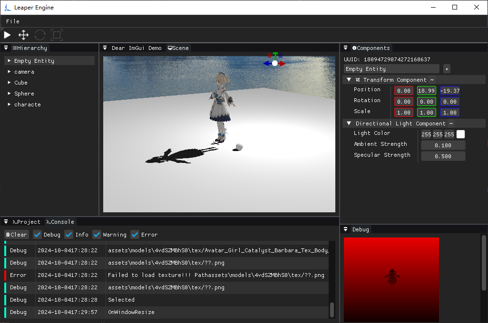

# Leaper Engine

<!-- PROJECT LOGO -->
<br />

<p align="center">
  <a href="https://github.com/lyh_2009/leaper/">
    
  </a>
</p>

**Leaper Engine** is a tiny game engine.

   [](https://github.com/lyh2009/leaper/blob/main/LICENSE)
[](https://github.com/lyh2009) [](https://space.bilibili.com/1593901415?spm_id_from=333.1007.0.0)
 

### Prerequisites

1. CMake 3.12(or more recent)
2. Git 2.1(or more recent)
3. Compiler with C++17 support (Clang 18.1 , GCC 13.2 , MSVC 14)

### Build Leaper
Install the Vulkan SDK and copy the 'Lib' folder to the 'engine/3rdparty/VulkanSDK/Win32/' directory.
###### Build on Windows
```
mkdir build
cd build
cmake ../
```
### Screenshot



### License

The project is licensed under the **MIT license**, see  [LICENSE.txt](https://github.com/lyh2009/leaper/blob/main/LICENSE)